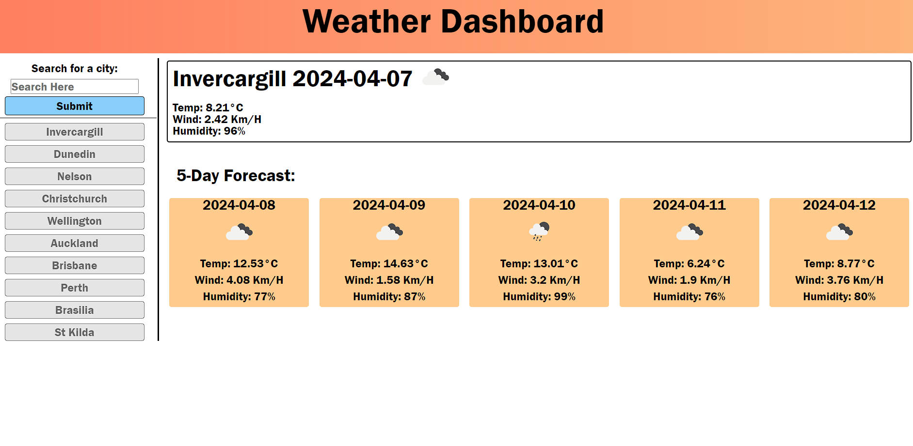

# <Weather Dashboard>

## Links
Github - https://github.com/LukeHunter1991

Webpage - https://lukehunter1991.github.io/weather_dashboard/

## File Layout
```md
Weather Dashboard
├── assets
│   ├── css
│   │   ├── reset.css
│   │   └── style.css
│   │
│   └── js
│       └── logic.js
├── index.html
└── README.md
```

## Description

I created a dashboard to show to show the current weather information for a given city, along with a 5 day forecast. I did this as I wanted an easy way to check up on weather in different cities to amke it easier to travel. I also wanted to challenge myself to gain a better understanding of using APIs in my projects. In building this project I researched many APIs and I learned a lot about the free Open Weather Map API.


## Installation

No installation needed. This web app will run directly in your browser.

## Usage

To use the web app simply type a city name in the search field and submit. You will then be presented with the current weather details and a 5 day forecast for that city. The last 10 cities that have been searched are also saved below the search field. You can click on those items to search again.


